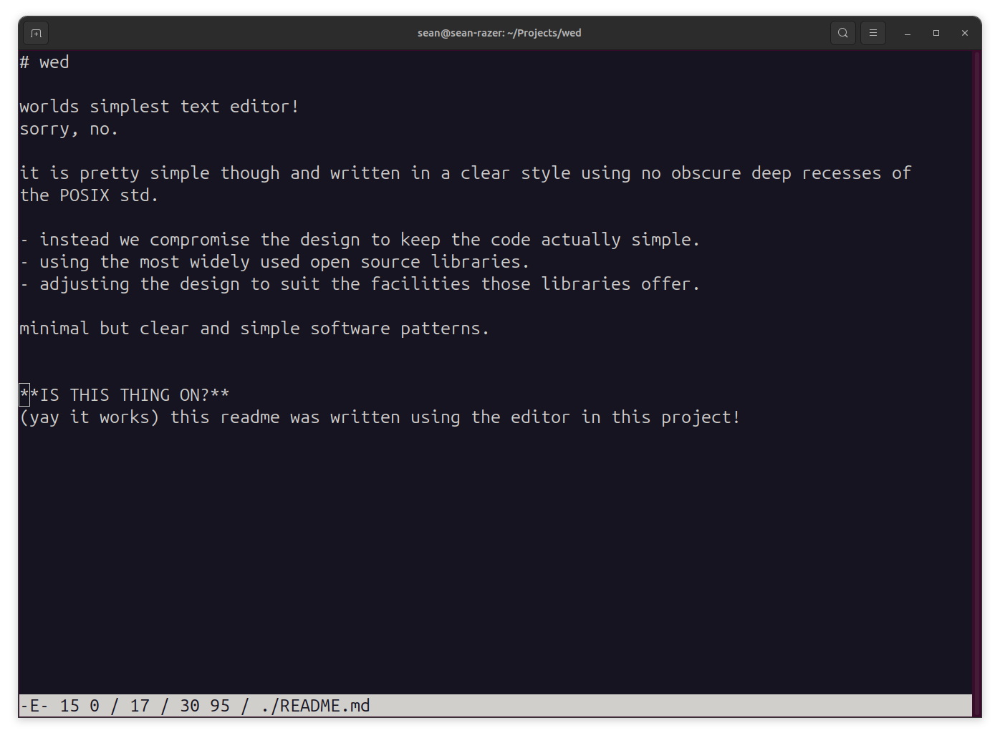

# wed

worlds simplest text editor! 
sorry, no. 

it is pretty simple though and written in a clear style using no obscure deep recesses of 
the POSIX std.

- instead we compromise the design to keep the code actually simple. 
- using the most widely used open source libraries.
- adjusting the design to suit the facilities those libraries offer.

minimal but clear and simple software patterns.

---

### Instructions

- Command Line Param is file to edit (it must exist)
- Arrows Keys PgUp Down Home and End all Move Cursor
- Backspace Removes Chars
- Enter moves to next line

- F5 Reload File
- F6 Save File
- F12 Quit

---

**IS THIS THING ON?**
(yay it works) this readme was written using the editor in this project!

